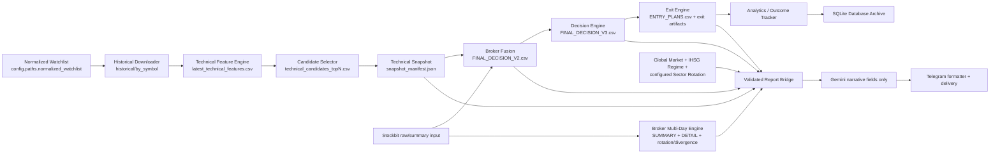

# SDE Swing V1.7.0 Multi-Source — Pipeline Validation Report

**Audit date:** 2026-08-04 (Asia/Jakarta)
**Scope:** stabilization and integration validation only.  Decision scoring, thresholds, and the BUY/WATCH/AVOID strategy were not changed.

## Executive result

The versioned runtime now has one report boundary and one engine lineage:

- `run_sde_job_integrated.py` invokes `run_sde_job.py` in engine-only mode, then builds reports from the exact engine artifacts.
- `full_manual` uses the same ordered stage handlers as individual jobs; it no longer calls `master_pipeline.py` for the official `1.7.0-multisource` configuration.
- Report sources are fail-closed. Missing/empty/malformed files, missing required columns, stale market data, missing actionable entry plans, and missing source fields raise `ReportSourceValidationError` and are written to the audit log.
- Reports carry `input_paths`, `source_of_truth`, row counts, and validation details. `write_payloads()` appends JSONL lineage events under `data/output/reports/audit/`.
- Gemini is restricted to `main_reason`, `main_risk`, and `execution_note`. Telegram remains a formatter/delivery layer and cannot create decisions or trade-plan values.
- The integrated parent passes one `run_id` to the engine child; Broker Fusion is reused within that run instead of being executed twice.
- Individual `broker_multi_day` runs reconcile their published multi-day manifest to the preceding `broker_summary` run, while Full Manual keeps the shared run ID.

The current workspace cannot complete a live end-to-end run yet: no Python executable is available, `data/output/market/SECTOR_ROTATION.json` is not present, and the newly wired multi-day engine outputs have not been generated in this workspace. The correct behavior is a clear validation failure, not an `UNKNOWN`, `DATA_NOT_AVAILABLE`, or `NOT_CONFIGURED` report.

## Canonical pipeline

## Source-of-truth mapping

| Stage | Engine owner | Canonical input/output | Report consumer | Validation |
|---|---|---|---|---|
| Watchlist | normalized watchlist + historical downloader | `config.paths.normalized_watchlist` → `data/output/historical/by_symbol/` | Technical stage | exact configured path; date/row manifests |
| Historical | historical downloader | `YAHOO_REFRESH_MANIFEST_<run>.json` | Snapshot manifest | provider/date/quality metadata |
| Technical | technical feature engine | `data/output/technical/latest_technical_features.csv` | Snapshot + Post Market | snapshot must point to an existing copied file |
| Candidate | candidate selector | `data/output/candidates/technical_candidates_top{top}.csv` | Snapshot + Post Market | exact snapshot output path |
| Broker Summary | Broker Fusion | report source `data/input/FINAL_DECISION_V2.csv`; raw `BROKER_SUMMARY_LATEST.csv` is upstream-only input | Broker Summary report | `Symbol`, broker state, broker score, `NET_FLOW` |
| Broker Multi-Day | `broker_multiday_engine` + `write_multiday_outputs` + existing `decision_bridge` contract | `BROKER_MULTIDAY_SUMMARY.csv`, `BROKER_MULTIDAY_DETAIL.csv`, rotation/divergence/window files, manifest; context columns attached to Broker Fusion input | Multi-Day report + Decision Engine context | context, score, confidence, blocker, symbol; summary/detail must exist; protected decision columns are checked |
| Decision | Decision Engine | `data/output/decision/FINAL_DECISION_V3.csv` | Final Watchlist | symbol and final decision are required |
| Exit | Exit Engine | `data/output/exit/ENTRY_PLANS.csv` and exit artifacts | Final Watchlist/detail | actionable rows require entry low/high, stop, TP1, TP2, and RR |
| Analytics | Outcome Tracker | `data/output/analytics/performance/` | run manifest / operational status | non-blocking only after engine artifacts are present |
| Database | `swing_history_db.py` | `data/database/sde_swing_history.db` plus source snapshots | run manifest | archives historical, technical, candidates, broker, fusion, decision, entry/exit, and multi-day snapshots |
| Market Outlook | Global Market Engine + IHSG regime engine | `global_market_snapshot.json`, `market_outlook_regime.json`, configured `data/output/market/SECTOR_ROTATION.json` | Market Outlook | regime, IHSG change/trend/momentum/breadth, execution mode, provider/mode/coverage, and four rotation buckets |
| Post Market | snapshot manifest | `Snapshot_Manifest` referenced by the stage manifest | Post Market | snapshot id/date/provider/mode/coverage and exact technical/candidate output files |
| Gemini | `GeminiInterpreter` | validated report facts only | narrative fields | immutable engine-field guard and numeric invention check |
| Telegram | daily report UI + delivery | `ReportPayload` | Telegram | formatter receives already validated values; no engine fallback path |

### Canonical field mapping

| Report | Canonical fields | Accepted engine aliases |
|---|---|---|
| Market Outlook | regime, IHSG change/trend/momentum, breadth, execution mode, provider, source mode, coverage | `market_regime/regime`, `ihsg_change_pct/change_pct`, `trend/ihsg_trend`, `momentum/ihsg_momentum`, `breadth/market_breadth` |
| Broker Summary | symbol, broker state, broker score, net flow | `Symbol/EMITEN/Ticker`, `Broker_Confirmation/Broker_Direction`, `Broker_Score/Broker_Confidence`, `NET_FLOW/Net_Flow` |
| Broker Multi-Day | symbol, context, score, confidence, blocker, per-window context | `Symbol/EMITEN/Ticker`, `Context/Broker_MultiDay_Context`, `Score/Broker_MultiDay_Score`, `Confidence/Broker_MultiDay_Confidence`, `Blocker/Broker_MultiDay_Blocker` |
| Final Watchlist | decision symbol/status plus engine exit plan | `FINAL_DECISION_V3.csv` and `ENTRY_PLANS.csv`; plans map `Entry_Zone_Low/High`, `Initial_Stop`, `Target_1/2`, `RR_To_Resistance` |

## Individual jobs and Full Manual parity

For the official config version, Full Manual runs this same graph:

1. `pre_market`
2. `market_outlook`
3. `post_market`
4. `technical_snapshot`
5. `universe_selection`
6. `candidate_selection`
7. `broker_summary`
8. `broker_multi_day`
9. `final_watchlist` (Broker Fusion → Decision → Exit → analytics → DB)

The stage status files are written with the individual job names, so dependency validation checks the same trade date and config version as scheduled execution. A final report bundle is rendered once after all source contracts pass.

`master_pipeline.py`, the old report builders, and their compatibility fallbacks remain available only for non-versioned/legacy test contexts. They are not selected by the official `1.7.0-multisource` path.

## Fallback and duplicate-logic audit

| Previous risk | Stabilization |
|---|---|
| Enhanced bridge selected arbitrary “latest” sector/multi-day files | Removed glob/latest discovery; paths are exact and manifest/config driven. |
| Broker report fell back to raw data and recomputed net flow | Broker report now consumes Broker Fusion output; no report-side score/net-flow calculation. |
| Integrated parent and engine child selected different manifests | Parent-generated `run_id` is passed through `--run-id`; all exact-run manifest reads now reconcile. |
| Full Manual reran Broker Fusion before Decision | The shared fusion helper reuses a valid same-run/date fusion manifest. |
| Final Watchlist used incorrect Exit Engine aliases and decision-row fallback values | Mapped to `Entry_Zone_Low`, `Entry_Zone_High`, `Initial_Stop`, `Target_1`, `Target_2`, `RR_To_Resistance`; missing actionable plans fail closed. |
| Post Market silently used an arbitrary/latest snapshot | Uses the exact `Snapshot_Manifest` and exact `snapshot.output_paths`. |
| Individual Post Market parent had no exact stage manifest to hand to the report bridge | The child publishes `SWING_RUN_MANIFEST_<run_id>.json` immediately after the technical snapshot is created; the final stage may extend that same run manifest. |
| Official refresh failure reused an existing snapshot | Existing-snapshot refresh fallback is disabled for the versioned runtime and scheduler config. `--preview-existing` remains an explicit operator mode. |
| Full Manual used the deprecated `master_pipeline.py` path | Versioned Full Manual calls the same stage handlers as individual jobs. |
| Telegram/UI created missing values | Daily report formatter defaults were removed; source validation occurs before formatting. |
| Gemini could be interpreted as an engine | Immutable fields are rejected; only three narrative fields are accepted. Deterministic fallback is narrative-only. |

## Validation contract

Implemented in `modules/job_runner/report_validation.py`:

- required file existence, non-empty CSV/JSON, and parseability;
- required aliases/columns and non-empty source values;
- market coverage normalization and stale-market rejection;
- exact snapshot technical/candidate output paths;
- broker summary and multi-day required fields;
- final decision/entry-plan symbol reconciliation and actionable plan completeness;
- structured `ReportSourceValidationError` payloads;
- success/error audit events with input paths and source-of-truth labels.

Audit path: `data/output/reports/audit/<trade_date>.jsonl`.

## Missing-field behavior

Any required file/column/value failure is a report error with the report type, exact input path, source-of-truth path, and failing field in the JSONL audit. Actionable decisions without a complete `ENTRY_PLANS.csv` row are blocked. A missing sector-rotation artifact, stale market regime, invalid snapshot, partial multi-day coverage, or symbol mismatch cannot reach Gemini or Telegram.

## Known missing upstream data / operational blockers

The repository does not currently contain an engine-owned sector rotation artifact at `data/output/market/SECTOR_ROTATION.json`. Market Outlook therefore fails with an explicit input-file validation error until that producer is supplied/configured.

The repository contains dated raw broker archives, and the multi-day stage is now wired to generate its outputs from those captures and attach the published context contract to the Broker Fusion input without touching protected decision columns. The captured archive currently covers fewer than the required 20 market sessions, so it is not `VALID`; the bridge intentionally blocks Decision/Report consumption until coverage is complete. Because Python is unavailable in this environment, those outputs were not regenerated during this audit. A live run also requires current-day broker input and the configured source-reconciliation prerequisites (ZAPI validation is fail-closed when configured as blocking).

## Verification performed

- Understand-Anything baseline graph: 259 files, 1,246 nodes, 3,837 edges, 9 layers, 8 tour steps; validation reported 0 issues and 29 orphan warnings. The bundled Python merge phase was unavailable, so deterministic extraction/merge was used.
- Node JSON parse: `config/pipeline.json`, `config/scheduler.json`, `config/data_sources.json`, and `.ua/knowledge-graph.json` all parse successfully.
- Tree-sitter Python grammar parse: the prior audit baseline parsed the then-modified runtime files without `ERROR`/`MISSING` nodes. The continuation files were not grammar-parsed because the bundled parser/runtime is unavailable in this environment.
- `git diff --check`: PASS; no introduced whitespace errors remain.
- `python -m pytest`, `py -3 -m pytest`, and `python3 -m pytest` could not run because no Python executable is installed/on PATH in this workspace.

## Risk and release gate

No decision/scoring/threshold code was intentionally changed. The main release gate is operational data completeness: provide the sector-rotation engine artifact, ensure Python/runtime dependencies are installed, generate the multi-day files, then run the integrated Full Manual with Telegram disabled and inspect the report audit JSONL before enabling delivery.

## Continuation Status (2026-08-04)

This continuation started from the report and working-tree diff above; the audit was not restarted. The changes below are stabilization-only. No scoring weights, decision thresholds, BUY/WATCH/AVOID policy, or entry/exit expectancy formula was intentionally changed.

## Remaining Blockers Resolved (code-level)

| Blocker | Resolution | Runtime status |
|---|---|---|
| Sector rotation producer | Added `modules/market_data/sector_rotation.py`; `job_market_outlook` writes the configured artifact. It is fail-closed when sector metadata is absent. | NOT TESTED; current workspace has no sector metadata and no artifact |
| Broker multi-day runtime | Archive grouping writes summary/detail/rotation/divergence/window comparison/manifest with session count, date range, coverage, source files, per-window context, score/confidence/blocker. `<20` sessions is `INSUFFICIENT_HISTORY`; no Decision Context bridge is performed. | NOT TESTED; local archive contains 6 sessions |
| Exit-engine hard-blocker crash | Existing `volume_confirmed: bool | None = None` remains before blockers; regression coverage was added for all six requested rejection paths. | NOT TESTED; Python unavailable |
| Partial broker coverage | Broker Fusion floor is 80%; 80–<100% is `PARTIAL_COVERAGE` and Broker Summary returns `SUCCESS_WITH_WARNING`; below floor raises/fails. Missing symbols retain `False`/`NO DATA`/`0` defaults. | NOT TESTED; existing artifact is 39/40 (97.5%) |
| Preview-existing dependency | Final Watchlist preview validates exact date, config version/hash, canonical manifests, source outputs, broker date/coverage, and market artifacts. Old delivery status is not used as a blocker once those artifacts are valid. | NOT TESTED |
| Telegram configuration | Delivery reads environment first and the configured runtime JSON. Official runs with missing credentials record `SKIPPED_NOT_CONFIGURED`; engine/report status remains independent of delivery. | NOT TESTED; no live send was attempted |
| Analytics labels | Outcome Tracker now separates `Current_Recommendations`, `Historical_Evaluated_Signals`, `Triggered_Lifecycle`, and `Closed_Outcomes`; partial broker quality is not silently counted as invalid. Backtest manifest/summary exposes the same distinctions without making `BUY ON TRIGGER` executable. | NOT TESTED; old output remains until analytics is regenerated |

## Sector Rotation Producer

The canonical JSON contains `trade_date`, `provider`, `source_mode`, `coverage`, and exactly these bucket keys: `leading`, `improving`, `weakening`, `lagging`. With valid sector metadata, the documented presentation-only formula is:

`strength = 0.6 * mean(Return_20D) + 0.4 * mean(Return_5D)` and `momentum = mean(Return_5D) - mean(Return_20D) / 4`.

If sector columns/metadata are absent, the producer writes `status=INSUFFICIENT_DATA`, `provider=NONE`, `source_mode=UNAVAILABLE`, `coverage=0`, and empty buckets. Report validation rejects that artifact; no sector or stock value is fabricated and no Decision Engine input is modified.

## Broker Multi-Day Runtime Result

The implementation consumes the dated `BROKER_RAW_*.csv` archives, chooses one capture per market session, and records `market_dates`, `session_count`, `minimum_sessions`, `coverage_ratio`, `date_range`, and `source_files` in `BROKER_MULTIDAY_MANIFEST.json`. Detail rows now include `Broker_Context_1D/3D/5D/10D/20D`, `Broker_MultiDay_Score`, `Broker_MultiDay_Confidence`, and blocker fields. Valid history is the only condition that can bridge context into `FINAL_DECISION_V2.csv`; insufficient history is reported but does not block a valid one-day Broker Summary or force multi-day values into the final decision.

Observed local input: 10 archive files representing 6 market sessions (`2026-07-27` through `2026-08-03`), below the required 20. Therefore the expected runtime result is `SUCCESS_WITH_WARNING` at the stage level with `INSUFFICIENT_HISTORY`, not a false `VALID` conclusion.

## Exit Engine Regression

`tests/test_signal_quality_v160.py` now covers `INVALID_STOP`, `MAXIMUM_RISK_EXCEEDED`, `LIQUIDITY_VERY_POOR`, `ENTRY_HARD_BLOCKER`, `PRICE_EXTENDED_HARD`, and `NO_VALID_RESISTANCE_PATH`, asserting `Volume_Confirmation_Pass is None` for every pre-volume hard rejection. The test file was not executable in this workspace because Python is unavailable.

## Partial Broker Coverage Regression

The operational gate is now `min_coverage=0.8` with `allow_partial_broker=true` in `config/pipeline.json`. The flag permits 80–<100% output to be labeled `PARTIAL_COVERAGE`; it cannot override the floor. The current canonical fusion manifest records 39/40 (97.5%) and missing-symbol defaults are preserved by Broker Fusion.

## Preview Existing Dependency Behavior

`--preview-existing` no longer trusts `*_latest.json` delivery status. It still rejects stale dates, config-version/hash mismatch, malformed/missing canonical artifacts, broker date/coverage failures, and invalid market/sector artifacts. It reuses a validated prior Broker Fusion manifest while generating the final engine outputs under the current run ID.

## Telegram Configuration Behavior

Credential lookup is environment-first (`TELEGRAM_BOT_TOKEN`, `TELEGRAM_CHAT_ID`), with `config/telegram.json` as the runtime fallback. Topic routing continues to honor `TELEGRAM_THREAD_REPORT_ID`/category thread variables. Missing credentials are represented as `SKIPPED_NOT_CONFIGURED` delivery events and `SUCCESS_WITH_WARNING` pipeline status; a real Telegram request was not made during this continuation.

## Analytics Label Correction

The existing pre-change file still shows `Signals=0`, `Excluded_Invalid_Data=11`, `Triggered=0`, and `Closed=0`. That is a stale generated artifact, not a new runtime result. The code now counts the 11 `BUY ON TRIGGER` recommendations as current recommendations/evaluated signal records when their quality is `PARTIAL_COVERAGE`, while retaining separate triggered and closed counts. Backtest summaries also backfill `Current_Recommendations` from the input signal set even when no H+1 rows are evaluable. No expectancy calculation or entry eligibility policy was changed.

## Full Manual vs Individual Job Parity

The official Full Manual stage graph remains the same ordered handlers as individual jobs. Multi-day partial history is a warning with no context bridge; the final stage continues on one-day Broker Fusion. Enhanced Full Manual/Final Watchlist report assembly skips only the invalid multi-day report and records the validation event; individual `broker_multi_day` report generation remains explicitly fail-closed. A live parity run was not possible without Python.

## Actual Test Commands / Results

| Command/check | Result |
|---|---|
| `git diff --check` | PASS (no whitespace errors) |
| Node JSON parse for `config/pipeline.json`, `config/scheduler.json` | PASS |
| `python -m pytest` / `py -3 -m pytest` / `python3 -m pytest` | NOT RUN: no Python executable on PATH |
| `python -u run_sde_job_integrated.py --job full_manual --no-telegram --debug` | NOT RUN: blocked by missing Python; no PASS claim |
| `python -u run_sde_job_integrated.py --job final_watchlist --preview-existing --no-telegram --debug` | NOT RUN: blocked by missing Python |
| Audit JSONL inspection | NOT RUN; no continuation audit JSONL was generated without the runtime |

## Files Changed in This Continuation

`modules/market_data/sector_rotation.py`, `modules/job_runner/core.py`, `run_sde_job.py`, `run_sde_job_integrated.py`, `modules/job_runner/delivery.py`, `modules/job_runner/report_validation.py`, `modules/data_sources/broker_multiday_engine.py`, `modules/data_sources/broker_multiday_output.py`, `modules/broker_fusion/broker_fusion.py`, `modules/analytics/outcome_tracker.py`, `modules/backtesting/backtest_engine.py`, `modules/job_runner/enhanced_runtime_bridge.py`, `config/pipeline.json`, `tests/test_signal_quality_v160.py`, `tests/test_broker_fusion_partial.py`, and `tests/test_sector_rotation.py`.

## Commit SHA

`5149752` (current branch HEAD/base audit commit). Continuation changes are intentionally uncommitted; the working tree also contains pre-existing audit/user modifications and the staged `.env.example` deletion.

## Final Stage Status

| Stage | Status |
|---|---|
| Market Outlook / sector rotation | WARNING — producer is fail-closed; current source artifact is absent |
| Broker Summary / partial coverage | WARNING — code/config supports 39/40; runtime not executed |
| Broker Multi-Day | WARNING — code writes complete contract; local history is 6/20 sessions |
| Decision / Exit / Final Watchlist | NOT TESTED — Python unavailable; final remains fail-closed on invalid dependencies |
| Analytics labels | WARNING — code corrected; generated outputs not regenerated |
| Telegram delivery | NOT TESTED — credentials were not used |
| Full Manual vs individual parity | NOT TESTED — required runtime command blocked |

Overall continuation gate: **NOT TESTED / WARNING**, not PASS.
