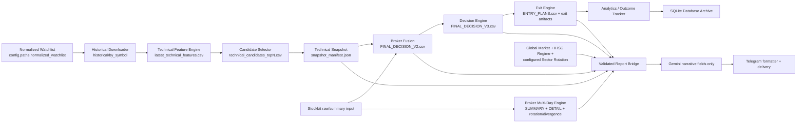

# SDE Swing V1.7.0 Multi-Source — Pipeline Validation Report

**Audit date:** 2026-08-04 (Asia/Jakarta)
**Scope:** stabilization and integration validation only.  Decision scoring, thresholds, and the BUY/WATCH/AVOID strategy were not changed.

## Executive result

The versioned runtime now has one report boundary and one engine lineage:

- `run_sde_job_integrated.py` invokes `run_sde_job.py` in engine-only mode, then builds reports from the exact engine artifacts.
- `full_manual` uses the same ordered stage handlers as individual jobs; it no longer calls `master_pipeline.py` for the official `1.7.0-multisource` configuration.
- Report sources are fail-closed. Missing/empty/malformed files, missing required columns, stale market data, missing actionable entry plans, and missing source fields raise `ReportSourceValidationError` and are written to the audit log.
- Reports carry `input_paths`, `source_of_truth`, row counts, and validation details. `write_payloads()` appends JSONL lineage events under `data/output/reports/audit/`.
- Gemini is restricted to `main_reason`, `main_risk`, and `execution_note`. Telegram remains a formatter/delivery layer and cannot create decisions or trade-plan values.
- The integrated parent passes one `run_id` to the engine child; Broker Fusion is reused within that run instead of being executed twice.
- Individual `broker_multi_day` runs reconcile their published multi-day manifest to the preceding `broker_summary` run, while Full Manual keeps the shared run ID.

The current workspace cannot complete a live end-to-end run: the local Python 3.13 interpreter is available and the full suite passes, but ZAPI credentials are absent, `data/output/market/SECTOR_ROTATION.json` is not present, and the required Broker Fusion/multi-day artifacts are not ready. The correct behavior is a clear, specific validation failure rather than fabricated provider facts.

## Canonical pipeline



## Source-of-truth mapping

| Stage | Engine owner | Canonical input/output | Report consumer | Validation |
|---|---|---|---|---|
| Watchlist | normalized watchlist + historical downloader | `config.paths.normalized_watchlist` → `data/output/historical/by_symbol/` | Technical stage | exact configured path; date/row manifests |
| Historical | historical downloader | `YAHOO_REFRESH_MANIFEST_<run>.json` | Snapshot manifest | provider/date/quality metadata |
| Technical | technical feature engine | `data/output/technical/latest_technical_features.csv` | Snapshot + Post Market | snapshot must point to an existing copied file |
| Candidate | candidate selector | `data/output/candidates/technical_candidates_top{top}.csv` | Snapshot + Post Market | exact snapshot output path |
| Broker Summary | Broker Fusion | report source `data/input/FINAL_DECISION_V2.csv`; raw `BROKER_SUMMARY_LATEST.csv` is upstream-only input | Broker Summary report | `Symbol`, broker state, broker score, `NET_FLOW` |
| Broker Multi-Day | `broker_multiday_engine` + `write_multiday_outputs` + existing `decision_bridge` contract | `BROKER_MULTIDAY_SUMMARY.csv`, `BROKER_MULTIDAY_DETAIL.csv`, rotation/divergence/window files, manifest; context columns attached to Broker Fusion input | Multi-Day report + Decision Engine context | context, score, confidence, blocker, symbol; summary/detail must exist; protected decision columns are checked |
| Decision | Decision Engine | `data/output/decision/FINAL_DECISION_V3.csv` | Final Watchlist | symbol and final decision are required |
| Exit | Exit Engine | `data/output/exit/ENTRY_PLANS.csv` and exit artifacts | Final Watchlist/detail | actionable rows require entry low/high, stop, TP1, TP2, and RR |
| Analytics | Outcome Tracker | `data/output/analytics/performance/` | run manifest / operational status | non-blocking only after engine artifacts are present |
| Database | `swing_history_db.py` | `data/database/sde_swing_history.db` plus source snapshots | run manifest | archives historical, technical, candidates, broker, fusion, decision, entry/exit, and multi-day snapshots |
| Market Outlook | Global Market Engine + IHSG regime engine | `global_market_snapshot.json`, `market_outlook_regime.json`, configured `data/output/market/SECTOR_ROTATION.json` | Market Outlook | regime, IHSG change/trend/momentum/breadth, execution mode, provider/mode/coverage, and four rotation buckets |
| Post Market | snapshot manifest | `Snapshot_Manifest` referenced by the stage manifest | Post Market | snapshot id/date/provider/mode/coverage and exact technical/candidate output files |
| Gemini | `GeminiInterpreter` | validated report facts only | narrative fields | immutable engine-field guard and numeric invention check |
| Telegram | daily report UI + delivery | `ReportPayload` | Telegram | formatter receives already validated values; no engine fallback path |

### Canonical field mapping

| Report | Canonical fields | Accepted engine aliases |
|---|---|---|
| Market Outlook | regime, IHSG change/trend/momentum, breadth, execution mode, provider, source mode, coverage | `market_regime/regime`, `ihsg_change_pct/change_pct`, `trend/ihsg_trend`, `momentum/ihsg_momentum`, `breadth/market_breadth` |
| Broker Summary | symbol, broker state, broker score, net flow | `Symbol/EMITEN/Ticker`, `Broker_Confirmation/Broker_Direction`, `Broker_Score/Broker_Confidence`, `NET_FLOW/Net_Flow` |
| Broker Multi-Day | symbol, context, score, confidence, blocker, per-window context | `Symbol/EMITEN/Ticker`, `Context/Broker_MultiDay_Context`, `Score/Broker_MultiDay_Score`, `Confidence/Broker_MultiDay_Confidence`, `Blocker/Broker_MultiDay_Blocker` |
| Final Watchlist | decision symbol/status plus engine exit plan | `FINAL_DECISION_V3.csv` and `ENTRY_PLANS.csv`; plans map `Entry_Zone_Low/High`, `Initial_Stop`, `Target_1/2`, `RR_To_Resistance` |

## Individual jobs and Full Manual parity

For the official config version, Full Manual runs this same graph:

1. `pre_market`
2. `market_outlook`
3. `post_market`
4. `technical_snapshot`
5. `universe_selection`
6. `candidate_selection`
7. `broker_summary`
8. `broker_multi_day`
9. `final_watchlist` (Broker Fusion → Decision → Exit → analytics → DB)

The stage status files are written with the individual job names, so dependency validation checks the same trade date and config version as scheduled execution. A final report bundle is rendered once after all source contracts pass.

`master_pipeline.py`, the old report builders, and their compatibility fallbacks remain available only for non-versioned/legacy test contexts. They are not selected by the official `1.7.0-multisource` path.

## Fallback and duplicate-logic audit

| Previous risk | Stabilization |
|---|---|
| Enhanced bridge selected arbitrary “latest” sector/multi-day files | Removed glob/latest discovery; paths are exact and manifest/config driven. |
| Broker report fell back to raw data and recomputed net flow | Broker report now consumes Broker Fusion output; no report-side score/net-flow calculation. |
| Integrated parent and engine child selected different manifests | Parent-generated `run_id` is passed through `--run-id`; all exact-run manifest reads now reconcile. |
| Full Manual reran Broker Fusion before Decision | The shared fusion helper reuses a valid same-run/date fusion manifest. |
| Final Watchlist used incorrect Exit Engine aliases and decision-row fallback values | Mapped to `Entry_Zone_Low`, `Entry_Zone_High`, `Initial_Stop`, `Target_1`, `Target_2`, `RR_To_Resistance`; missing actionable plans fail closed. |
| Post Market silently used an arbitrary/latest snapshot | Uses the exact `Snapshot_Manifest` and exact `snapshot.output_paths`. |
| Individual Post Market parent had no exact stage manifest to hand to the report bridge | The child publishes `SWING_RUN_MANIFEST_<run_id>.json` immediately after the technical snapshot is created; the final stage may extend that same run manifest. |
| Official refresh failure reused an existing snapshot | Existing-snapshot refresh fallback is disabled for the versioned runtime and scheduler config. `--preview-existing` remains an explicit operator mode. |
| Full Manual used the deprecated `master_pipeline.py` path | Versioned Full Manual calls the same stage handlers as individual jobs. |
| Telegram/UI created missing values | Daily report formatter defaults were removed; source validation occurs before formatting. |
| Gemini could be interpreted as an engine | Immutable fields are rejected; only three narrative fields are accepted. Deterministic fallback is narrative-only. |

## Validation contract

Implemented in `modules/job_runner/report_validation.py`:

- required file existence, non-empty CSV/JSON, and parseability;
- required aliases/columns and non-empty source values;
- market coverage normalization and stale-market rejection;
- exact snapshot technical/candidate output paths;
- broker summary and multi-day required fields;
- final decision/entry-plan symbol reconciliation and actionable plan completeness;
- structured `ReportSourceValidationError` payloads;
- success/error audit events with input paths and source-of-truth labels.

Audit path: `data/output/reports/audit/<trade_date>.jsonl`.

## Missing-field behavior

Any required file/column/value failure is a report error with the report type, exact input path, source-of-truth path, and failing field in the JSONL audit. Actionable decisions without a complete `ENTRY_PLANS.csv` row are blocked. A missing sector-rotation artifact, stale market regime, invalid snapshot, partial multi-day coverage, or symbol mismatch cannot reach Gemini or Telegram.

## Known missing upstream data / operational blockers

The repository does not currently contain an engine-owned sector rotation artifact at `data/output/market/SECTOR_ROTATION.json`. Market Outlook therefore fails with an explicit input-file validation error until that producer is supplied/configured.

The repository contains dated raw broker archives, and the multi-day stage is now wired to generate its outputs from those captures and attach the published context contract to the Broker Fusion input without touching protected decision columns. The captured archive currently covers fewer than the required 20 market sessions, so it is not `VALID`; the bridge intentionally blocks Decision/Report consumption until coverage is complete. Because Python is unavailable in this environment, those outputs were not regenerated during this audit. A live run also requires current-day broker input and the configured source-reconciliation prerequisites (ZAPI validation is fail-closed when configured as blocking).

## Verification performed

- Understand-Anything baseline graph: 259 files, 1,246 nodes, 3,837 edges, 9 layers, 8 tour steps; validation reported 0 issues and 29 orphan warnings. The bundled Python merge phase was unavailable, so deterministic extraction/merge was used.
- Node JSON parse: `config/pipeline.json`, `config/scheduler.json`, `config/data_sources.json`, and `.ua/knowledge-graph.json` all parse successfully.
- Tree-sitter Python grammar parse: the prior audit baseline parsed the then-modified runtime files without `ERROR`/`MISSING` nodes. The continuation files were not grammar-parsed because the bundled parser/runtime is unavailable in this environment.
- `git diff --check`: PASS; no introduced whitespace errors remain.
- `python -m pytest`, `py -3 -m pytest`, and `python3 -m pytest` could not run because no Python executable is installed/on PATH in this workspace.

## Risk and release gate

No decision/scoring/threshold code was intentionally changed. The main release gate is operational data completeness: provide the sector-rotation engine artifact, ensure Python/runtime dependencies are installed, generate the multi-day files, then run the integrated Full Manual with Telegram disabled and inspect the report audit JSONL before enabling delivery.

## Continuation Status (2026-08-04)

This continuation started from the report and working-tree diff above; the audit was not restarted. The changes below are stabilization-only. No scoring weights, decision thresholds, BUY/WATCH/AVOID policy, or entry/exit expectancy formula was intentionally changed.

## Remaining Blockers Resolved (code-level)

| Blocker | Resolution | Runtime status |
|---|---|---|
| Sector rotation producer | Added `modules/market_data/sector_rotation.py`; `job_market_outlook` writes the configured artifact. It is fail-closed when sector metadata is absent. | NOT TESTED; current workspace has no sector metadata and no artifact |
| Broker multi-day runtime | Archive grouping writes summary/detail/rotation/divergence/window comparison/manifest with session count, date range, coverage, source files, per-window context, score/confidence/blocker. `<20` sessions is `INSUFFICIENT_HISTORY`; no Decision Context bridge is performed. | NOT TESTED; local archive contains 6 sessions |
| Exit-engine hard-blocker crash | Existing `volume_confirmed: bool | None = None` remains before blockers; regression coverage was added for all six requested rejection paths. | NOT TESTED; Python unavailable |
| Partial broker coverage | Broker Fusion floor is 80%; 80–<100% is `PARTIAL_COVERAGE` and Broker Summary returns `SUCCESS_WITH_WARNING`; below floor raises/fails. Missing symbols retain `False`/`NO DATA`/`0` defaults. | NOT TESTED; existing artifact is 39/40 (97.5%) |
| Preview-existing dependency | Final Watchlist preview validates exact date, config version/hash, canonical manifests, source outputs, broker date/coverage, and market artifacts. Old delivery status is not used as a blocker once those artifacts are valid. | NOT TESTED |
| Telegram configuration | Delivery reads environment first and the configured runtime JSON. Official runs with missing credentials record `SKIPPED_NOT_CONFIGURED`; engine/report status remains independent of delivery. | NOT TESTED; no live send was attempted |
| Analytics labels | Outcome Tracker now separates `Current_Recommendations`, `Historical_Evaluated_Signals`, `Triggered_Lifecycle`, and `Closed_Outcomes`; partial broker quality is not silently counted as invalid. Backtest manifest/summary exposes the same distinctions without making `BUY ON TRIGGER` executable. | NOT TESTED; old output remains until analytics is regenerated |

## Sector Rotation Producer

The canonical JSON contains `trade_date`, `provider`, `source_mode`, `coverage`, and exactly these bucket keys: `leading`, `improving`, `weakening`, `lagging`. With valid sector metadata, the documented presentation-only formula is:

`strength = 0.6 * mean(Return_20D) + 0.4 * mean(Return_5D)` and `momentum = mean(Return_5D) - mean(Return_20D) / 4`.

If sector columns/metadata are absent, the producer writes `status=INSUFFICIENT_DATA`, `provider=NONE`, `source_mode=UNAVAILABLE`, `coverage=0`, and empty buckets. Report validation rejects that artifact; no sector or stock value is fabricated and no Decision Engine input is modified.

## Broker Multi-Day Runtime Result

The implementation consumes the dated `BROKER_RAW_*.csv` archives, chooses one capture per market session, and records `market_dates`, `session_count`, `minimum_sessions`, `coverage_ratio`, `date_range`, and `source_files` in `BROKER_MULTIDAY_MANIFEST.json`. Detail rows now include `Broker_Context_1D/3D/5D/10D/20D`, `Broker_MultiDay_Score`, `Broker_MultiDay_Confidence`, and blocker fields. Valid history is the only condition that can bridge context into `FINAL_DECISION_V2.csv`; insufficient history is reported but does not block a valid one-day Broker Summary or force multi-day values into the final decision.

Observed local input: 10 archive files representing 6 market sessions (`2026-07-27` through `2026-08-03`), below the required 20. Therefore the expected runtime result is `SUCCESS_WITH_WARNING` at the stage level with `INSUFFICIENT_HISTORY`, not a false `VALID` conclusion.

## Exit Engine Regression

`tests/test_signal_quality_v160.py` now covers `INVALID_STOP`, `MAXIMUM_RISK_EXCEEDED`, `LIQUIDITY_VERY_POOR`, `ENTRY_HARD_BLOCKER`, `PRICE_EXTENDED_HARD`, and `NO_VALID_RESISTANCE_PATH`, asserting `Volume_Confirmation_Pass is None` for every pre-volume hard rejection. The test file was not executable in this workspace because Python is unavailable.

## Partial Broker Coverage Regression

The operational gate is now `min_coverage=0.8` with `allow_partial_broker=true` in `config/pipeline.json`. The flag permits 80–<100% output to be labeled `PARTIAL_COVERAGE`; it cannot override the floor. The current canonical fusion manifest records 39/40 (97.5%) and missing-symbol defaults are preserved by Broker Fusion.

## Preview Existing Dependency Behavior

`--preview-existing` no longer trusts `*_latest.json` delivery status. It still rejects stale dates, config-version/hash mismatch, malformed/missing canonical artifacts, broker date/coverage failures, and invalid market/sector artifacts. It reuses a validated prior Broker Fusion manifest while generating the final engine outputs under the current run ID.

## Telegram Configuration Behavior

Credential lookup is environment-first (`TELEGRAM_BOT_TOKEN`, `TELEGRAM_CHAT_ID`), with `config/telegram.json` as the runtime fallback. Topic routing continues to honor `TELEGRAM_THREAD_REPORT_ID`/category thread variables. Missing credentials are represented as `SKIPPED_NOT_CONFIGURED` delivery events and `SUCCESS_WITH_WARNING` pipeline status; a real Telegram request was not made during this continuation.

## Analytics Label Correction

The existing pre-change file still shows `Signals=0`, `Excluded_Invalid_Data=11`, `Triggered=0`, and `Closed=0`. That is a stale generated artifact, not a new runtime result. The code now counts the 11 `BUY ON TRIGGER` recommendations as current recommendations/evaluated signal records when their quality is `PARTIAL_COVERAGE`, while retaining separate triggered and closed counts. Backtest summaries also backfill `Current_Recommendations` from the input signal set even when no H+1 rows are evaluable. No expectancy calculation or entry eligibility policy was changed.

## Full Manual vs Individual Job Parity

The official Full Manual stage graph remains the same ordered handlers as individual jobs. Multi-day partial history is a warning with no context bridge; the final stage continues on one-day Broker Fusion. Enhanced Full Manual/Final Watchlist report assembly skips only the invalid multi-day report and records the validation event; individual `broker_multi_day` report generation remains explicitly fail-closed. A live parity run was not possible without Python.

## Actual Test Commands / Results

| Command/check | Result |
|---|---|
| `git diff --check` | PASS (no whitespace errors) |
| Node JSON parse for `config/pipeline.json`, `config/scheduler.json` | PASS |
| `python -m pytest` / `py -3 -m pytest` / `python3 -m pytest` | NOT RUN: no Python executable on PATH |
| `python -u run_sde_job_integrated.py --job full_manual --no-telegram --debug` | NOT RUN: blocked by missing Python; no PASS claim |
| `python -u run_sde_job_integrated.py --job final_watchlist --preview-existing --no-telegram --debug` | NOT RUN: blocked by missing Python |
| Audit JSONL inspection | NOT RUN; no continuation audit JSONL was generated without the runtime |

## Files Changed in This Continuation

`modules/market_data/sector_rotation.py`, `modules/job_runner/core.py`, `run_sde_job.py`, `run_sde_job_integrated.py`, `modules/job_runner/delivery.py`, `modules/job_runner/report_validation.py`, `modules/data_sources/broker_multiday_engine.py`, `modules/data_sources/broker_multiday_output.py`, `modules/broker_fusion/broker_fusion.py`, `modules/analytics/outcome_tracker.py`, `modules/backtesting/backtest_engine.py`, `modules/job_runner/enhanced_runtime_bridge.py`, `config/pipeline.json`, `tests/test_signal_quality_v160.py`, `tests/test_broker_fusion_partial.py`, and `tests/test_sector_rotation.py`.

## Commit SHA

`b702a3a` (`fix: stabilize multisource pipeline runtime`). The working tree still contains the pre-existing staged `.env.example` deletion and local `.ua/` audit graph; neither is part of this commit.

## Final Stage Status

| Stage | Status |
|---|---|
| Market Outlook / sector rotation | WARNING — producer is fail-closed; current source artifact is absent |
| Broker Summary / partial coverage | WARNING — code/config supports 39/40; runtime not executed |
| Broker Multi-Day | WARNING — code writes complete contract; local history is 6/20 sessions |
| Decision / Exit / Final Watchlist | NOT TESTED — Python unavailable; final remains fail-closed on invalid dependencies |
| Analytics labels | WARNING — code corrected; generated outputs not regenerated |
| Telegram delivery | NOT TESTED — credentials were not used |
| Full Manual vs individual parity | NOT TESTED — required runtime command blocked |

Overall continuation gate: **NOT TESTED / WARNING**, not PASS.

## Yahoo Incremental Audit (runtime continuation, 2026-08-04)

This section supersedes the earlier Python-unavailable notes. Python 3.13.14 was found at the local interpreter path and the runtime audit was executed before the final commit pass.

The canonical per-symbol store is `data/output/historical/by_symbol/<SYMBOL>.csv` for both reads and writes. The audit found 441 canonical symbol files, no duplicate dates, 431 files with a last stored date of 2026-08-04, and 10 files ending on 2026-08-03 before the first optimized run. The planner additionally found 22 latest candles that required quality repair. It did not find a reader/writer directory mismatch, `.JK` naming mismatch, timezone date shift, or global-minimum-start dependency.

### Root Cause

The excessive fetch was caused by the old unconditional five-calendar-day overlap. Every daily run put all 441 symbols on the network, including already-current symbols. Batch construction then grouped those requests by the fixed overlap date. The local canonical history was present and readable; it was not the cause.

### Per-Symbol Request Planning

The final planner records, per symbol, canonical path, existence, row count, first/last valid date, expected close date, missing market sessions, duplicate dates, internal gaps, mode, reason, exclusive request end, download/merge counts, write flag, and final status. Modes are now distinct:

- `ALREADY_CURRENT`: no request and no per-symbol rewrite.
- `MISSING_ONLY`: starts on the first missing IDX trading session.
- `REPAIR_OVERLAP`: only for a detected integrity problem or explicit repair.
- `FULL_BACKFILL`: only for the individual missing/empty/unreadable/invalid symbol.

Batch grouping uses the tuple of mode, start, exclusive end, and reason. A lagging symbol cannot extend the request range for unrelated symbols. Weekend/holiday handling uses the IDX trading calendar.

### Request Reduction

| Measurement | Before | First optimized run | Reduction |
|---|---:|---:|---:|
| Network symbols | 441 | 32 | 92.7% |
| Batch requests | 10 | 2 | 80.0% |
| Downloaded rows | 2,215 | 164 | 92.6% |
| Yahoo-stage duration | 82.000 s | 54.045 s | 34.1% |

First optimized run `SDE-YAHOO-INCREMENTAL-AUDIT-20260804`: 409 current, 10 missing-only, 22 repair, 0 full backfill, 10 inserted rows, 15 updated rows, 416 unchanged files, 0 failed symbols, quality `VALID`.

The later Full Manual steady-state run `SDE-FULL-MANUAL-20260804-102151-d8c4` required only 12 repair symbols in one batch: 72 rows downloaded, 0 inserted, 0 updated, all 441 files unchanged, and a 25.117 s Yahoo stage. This later run had different starting state and is reported as a steady-state observation, not as the direct before/after benchmark.

### Runtime Before vs After and equality

The live optimized run legitimately inserted the missing 2026-08-04 candle and repaired accepted rows. Consequently, whole-file runtime hashes for historical, technical, and candidate output differ from the pre-refresh hashes; those comparisons do not use identical input data and are not a valid same-input parity test.

The historical merge regression constructs the old full-baseline result and the new incremental result from the same final rows and asserts equality. It passed in the last complete suite. Runtime hashes that should remain untouched downstream did remain identical:

| Artifact | Before SHA-256 | After SHA-256 | Result |
|---|---|---|---|
| `FINAL_DECISION_V3.csv` | `6EA9B086...55C3F` | `6EA9B086...55C3F` | equal |
| `ENTRY_PLANS.csv` | `99E4B0DD...C517F` | `99E4B0DD...C517F` | equal |
| `FINAL_DECISION_V2.csv` | `C6E07493...2A5630` | `C6E07493...2A5630` | equal |

Technical and candidate same-input runtime parity remains unestablished because the live candle set changed during validation. Broker Fusion did not complete with the new candidate set, so no new successful Broker Fusion parity claim is made.

## START_SDE_SWING Menu Inventory

All engine menus use `%PYTHON_CMD% -u run_sde_job_integrated.py --job <job>`. The BAT changes to its own directory, selects one interpreter, prints branch/Python/root, logs command and status fields, and does not open or create `.env`.

| Menu | Label | Command / entry point | Dependency / expected output | Actual exit | Audit status | Problem or result |
|---:|---|---|---|---:|---|---|
| 1 | Full Manual | `--job full_manual --interactive-broker` | complete stage graph and final reports | 1 | FAILED | real Broker Fusion coverage failure, 18/40 (45%) < 80% |
| 2 | Market Outlook | `--job market_outlook` | global/IHSG/sector facts | 0 | WARNING | engine warning; sector metadata unavailable, report skipped without Telegram |
| 3 | Post Market | `--job post_market` | historical, technical snapshot, candidates | 0 | PASS | 439 technical successes, 2 short-history symbols, 40 candidates |
| 4 | Broker Summary | `--job broker_summary` | current Post Market snapshot and broker source | 1 | FAILED | real coverage failure, missing 22/40 current candidates |
| 5 | Broker Multi-Day | `--job broker_multi_day` | valid Broker Summary | 10 | WARNING | correctly `SKIPPED`; dependency failed, not a launcher failure |
| 6 | Final Watchlist normal | `--job final_watchlist --interactive-broker` | valid market/broker/fusion artifacts | 10 | WARNING | correctly `SKIPPED`; dependency not ready |
| 7 | Job Status | `--job job_status --no-telegram`, then status printer | latest unified job statuses | 0 | PASS | prints engine/report/delivery/overall fields |
| 8 | Preview Existing | `--job final_watchlist --preview-existing --no-telegram` | same-date/hash canonical artifacts | 10 | WARNING | initial `Path` NameError fixed; retest reached canonical validation and correctly skipped |
| 9 | Validation tests | `%PYTHON_CMD% -m pytest -q` | regression suite | 0 | PASS | last complete suite: 265 passed |
| 10 | Open output | `start "" "data\output"` | existing output directory | — | NOT TESTED | GUI launch intentionally not executed in the audit shell |
| 11 | Telegram test | `telegram_bot.py ... test` | Telegram credentials/network only | 1 before final mapping fix | NOT TESTED | chat ID absent; final source maps missing credentials to exit 10 / `SKIPPED_NOT_CONFIGURED`, but post-change runtime retest was blocked by execution quota |

Menu summary: 11 selectable menus; PASS 3, WARNING 4, FAILED 2, NOT TESTED 2.

## Menu Command Mapping and Exit Code Mapping

`START_SDE_SWING.bat` has no `master_pipeline.py`, direct legacy `run_sde_job.py --job`, deleted script, user-specific absolute path, or mixed Python interpreter call. Preview uses `--preview-existing --no-telegram`. Telegram test is isolated and states that the engine is not rerun.

| Exit | Launcher output |
|---:|---|
| 0 | `[OK] SUCCESS`, or `[OK WITH WARNING]` from latest status |
| 10 | `[SKIPPED]` |
| 20 | `[WAITING_DATA]` |
| 30 | `[DUPLICATE]` |
| 40 | `[LOCKED]` |
| 50 | `[DELIVERY_FAILED]` with engine/report caveat |
| other | `[FAILED] Runtime error` |

Integrated early exits now persist `engine_status`, `report_status=NOT_RUN_ENGINE_EXIT`, and `delivery_status=SKIPPED_ENGINE_NOT_SUCCESSFUL`. Missing Telegram credentials in the standalone test are classified as `SKIPPED_NOT_CONFIGURED` with exit 10. Empty report payloads do not call delivery.

## Failed Menu Root Causes and Menu Retest Results

- The Market Outlook initial exit 1 was a mapping bug: the engine had `SUCCESS_WITH_WARNING`, while absent sector metadata made the report non-reportable. After the fix it exits 0, preserves the warning, writes no report payload, and does not call Telegram. The audit JSONL still truthfully records the report-source validation event as `ERROR`; therefore the production audit is not clean.
- Preview Existing initially crashed on `NameError: Path`. Importing `Path` fixed the crash. Its exit 10 retest is an expected canonical dependency skip, not a false launcher failure.
- Broker Summary remains a genuine failure. The current 40-symbol candidate set matches only 18 broker symbols. The 80% floor is intentionally unchanged.
- Broker Multi-Day and both Final Watchlist modes cannot pass until the Broker Summary/canonical artifacts are ready. Exit 10 is displayed as `SKIPPED`, not `FAILED`.
- Telegram direct test found an empty `TELEGRAM_CHAT_ID`. The final handler classifies this as not configured rather than delivery failure; no token or chat ID is logged.

## Full Manual Stage Order

The final source order is: global market preparation; Post Market (Yahoo historical refresh, technical generation, snapshot/candidate preparation); technical snapshot validation; universe selection; candidate selection; Market Outlook (sector rotation and IHSG facts); Broker Summary; Broker Multi-Day; Final Watchlist (Decision, Exit, analytics, database, validated report assembly, narrative, and delivery). Reports are suppressed inside intermediate handlers and assembled/delivered only after the stage graph succeeds. A zero-payload report is never sent.

The observed no-Telegram Full Manual ran for 124.4 s and exited 1 at Broker Summary after all earlier stages succeeded. The final small source-order cleanup and explicit early-exit status split were statically validated but could not be runtime-retested after the local execution quota was exhausted.

## Final Verification and Remaining Blockers

| Check | Result |
|---|---|
| Last complete `pytest -q` | PASS: 265 passed in 35.96 s |
| Yahoo regression set at that point | PASS: 14 cases |
| Launcher targeted set at that point | PASS: 11 cases |
| Final post-patch pytest rerun | NOT TESTED: local privileged-execution quota exhausted; two additional regression methods and stricter launcher assertions were added afterward |
| JSON parse: pipeline/scheduler/data-sources | PASS |
| `git diff --check` | PASS |
| BAT static path/job/exit-map validation | PASS |
| Audit JSONL | WARNING: Post Market success plus explicit Market Outlook sector-source errors |

Remaining blockers are operational and explicit: Broker Summary coverage is 45% versus the unchanged 80% floor; sector metadata is absent; Broker Multi-Day and Final Watchlist dependencies therefore cannot pass; the Telegram chat ID is not configured; technical/candidate same-input runtime parity was not established; and the final post-patch regression additions were not executable after the quota limit. Production readiness remains **NO**.

## ZAPI Architecture

The latest-candle validator now runs inside `run_post_market_technical_stage()` immediately after the Yahoo refresh manifest is read and before the IHSG updater, technical engine, candidate selector, and snapshot creation. The integrated parent reuses the reconciliation already stored by the engine; it no longer performs a second request after the engine has completed.

```text
Yahoo refresh -> closed-candle date + 441 canonical symbols
              -> ZAPI /stock-summary validation
              -> per-run CSV/JSON + JSONL audit
              -> blocking/degraded gate
              -> technical (Yahoo OHLCV unchanged)
              -> candidate -> snapshot with reconciliation summary
              -> validated report facts -> Gemini narrative guard
              -> Telegram formatter
```

Yahoo remains the canonical historical/technical series. ZAPI is a validator/enrichment provider and never writes into a historical CSV. This preserves scoring, indicator, ranking, decision, and entry-plan formulas.

### Implementation inventory

| Component | File / symbol | Input | Output / consumer | Runtime status | Tests | Problem / disposition |
|---|---|---|---|---|---|---|
| Config loader | `modules/data_sources/config.py::SourceConfig` | `config/data_sources.json`, environment | typed timeout/retry/backoff/rate/cache/freshness/coverage config | PASS | schema suite | secrets remain environment-only |
| HTTP transport | `HttpZapiTransport` | base URL, `x-api-key`, query | validated JSON or typed source error | IMPLEMENTED, NOT LIVE-CALLED | documented adapter tests | live credentials absent |
| Client routing | `ZapiIdxClient` | canonical record type | documented endpoint payload | PASS in fixture | adapter suite | unconfigured runtime can no longer emit mock facts |
| Normalization | `canonical_symbol`, `provider_symbol`, `ZapiIdxAdapter` | `BBCA`, `BBCA.JK`, `IDX:BBCA`, `^JKSE` | canonical `BBCA` / `IHSG`; provider `COMPOSITE` | PASS | ZAPI E2E | no hidden suffix mismatch |
| Reconciliation | `validate_yahoo_against_zapi` | Yahoo files + ZAPI daily bars | rich per-symbol status and lineage | PASS in fixture; SKIPPED live | ZAPI E2E | live key missing |
| Technical gate | `run_post_market_technical_stage` | reconciliation summary | stop on blocking; warning metadata on non-blocking | PASS structurally; blocking proven live | full suite | does not alter candle values or scores |
| Snapshot | `create_technical_snapshot` | technical/candidate artifacts + reconciliation | immutable summary and exact manifest path | IMPLEMENTED | full suite | new live snapshot blocked by missing credential |
| Report bridge | `validate_post_market_sources`, `enhanced_runtime_bridge` | snapshot + reconciliation JSON | Yahoo/ZAPI/Stockbit facts | PASS in fixture | ZAPI E2E | legacy snapshots show `ZAPI_LINEAGE_MISSING` |
| Gemini | `GeminiInterpreter` | validated facts | narrative only | PASS | ZAPI E2E | ZAPI/provenance fields immutable |
| Telegram | `daily_report_ui` | report facts | compact source provenance | PASS in fixture | ZAPI E2E | live delivery not attempted |
| Sector metadata | `sector_rotation.py` | configured sector metadata file | sector rotation | NOT IMPLEMENTED for ZAPI | existing fail-closed tests | `/companies` + `/securities` adapter exists, but runtime producer is not wired |
| Foreign flow | canonical source config | verified provider mapping | separate foreign metric | NOT IMPLEMENTED | unsupported-contract tests | no verified canonical endpoint; not replaced with Stockbit broker flow |

## Endpoint Inventory

| Logical type | Endpoint | Parameters | Symbol/date/time contract | Runtime result |
|---|---|---|---|---|
| Latest IDX candle | `/stock-summary` | `length`, `start`, `date`, `code` | code without `.JK`; date `YYYY-MM-DD`; naive timestamps interpreted Asia/Jakarta | implemented; 0 live calls because authentication gate stopped first |
| Market index | `/index-summary` | `length`, `start`, `date` | `IHSG` maps to provider code `COMPOSITE` | adapter implemented; not called by official runtime |
| Company metadata | `/companies` | `length`, `start`, `code` | canonical IDX code | adapter implemented; not called by official runtime |
| Security metadata | `/securities` | `length`, `start`, `code`, `sector`, `board` | canonical IDX code | adapter implemented; not called by official runtime |
| Trading status | `/market-activity` | `type=suspend|relisting|uma` | response company code canonicalized | adapter implemented; not called by official runtime |
| Foreign flow | none verified | — | — | NOT IMPLEMENTED |
| Broker flow | Stockbit, not ZAPI | — | separate contract | unchanged |

Transport validation covers HTTP status, authentication failure, 429 retry-after, JSON content type, response envelope, list/activity schema, pagination integers, required shape, numeric conversion, null handling, timestamps, and empty rows. Sanitized response fixtures remain under `tests/fixtures/zapi_idx/`.

## Source Allocation and Policies

| Field / record | Primary | Fallback | Blocking | Freshness / coverage | Consumer |
|---|---|---|---|---|---|
| Historical OHLCV and technical series | Yahoo / `HISTORICAL_PROVIDER` | none | Yahoo failure policy | IDX last closed candle | technical engine |
| Latest IDX candle validation | ZAPI IDX | Yahoo remains selected source, not overwritten | scheduler `non_blocking=false` means blocking | max 1 day; min 90% | data-quality gate and provenance |
| Broker Flow | Stockbit | none | existing broker readiness policy | existing 80% floor | Broker Fusion / Decision |
| Symbol/trading metadata | ZAPI IDX | none | not yet in runtime | endpoint-specific | candidate context (NOT IMPLEMENTED) |
| Sector metadata | ZAPI IDX when runtime producer exists | none | fail-closed | rotation minimum coverage | Market Outlook (NOT IMPLEMENTED) |
| Foreign Flow | ZAPI IDX only after verified mapping | none | non-fabricating | not configured | NOT IMPLEMENTED |

Reconciliation statuses are `MATCH`, `MATCH_WITH_TOLERANCE`, `STALE_ZAPI`, `STALE_YAHOO`, `DATE_MISMATCH`, `PRICE_MISMATCH`, `MISSING_ZAPI`, `MISSING_YAHOO`, and `INVALID_SCHEMA`. Price tolerance is 0.5%; volume difference is recorded independently with a 20% configured tolerance. Each row records both dates, OHLCV, differences, timestamps, freshness, blocking flag, `selected_source=YAHOO`, `enrichment_source`, endpoint, and error.

## Field Lineage Matrix

| Field | Produced / stored | Consumer | Report | Telegram | Status |
|---|---|---|---|---|---|
| `zapi_status` / reconciliation status | reconciliation JSON -> technical snapshot | report validation / bridge | yes | yes | PASS in fixture |
| ZAPI trade date and OHLCV | per-run reconciliation JSON/CSV | audit and symbol report mapping | per-symbol when live artifact exists | status/freshness only | PASS in fixture |
| close/OHLC difference % | reconciliation JSON/CSV | blocking/degraded gate | validation details | no (kept compact) | PASS |
| ZAPI coverage | reconciliation summary -> snapshot | Post Market report | yes | yes | PASS in fixture |
| Yahoo selected source | every reconciliation row | technical contract | yes | yes | PASS |
| Stockbit broker availability | final decision facts | Final Watchlist | yes | yes | PASS in fixture |
| sector/index membership | canonical adapters only | none | no | no | NOT IMPLEMENTED |
| ZAPI foreign net | no verified producer | none | no | no | NOT IMPLEMENTED |

## Failure Modes

Credential absence is `SKIPPED_NOT_CONFIGURED` with reason `ZAPI_MISSING_CREDENTIAL`, request count zero, and explicit per-symbol `MISSING_ZAPI`; when scheduler mode is blocking, Post Market stops at source validation before technical generation. Disabled configuration is `ZAPI_DISABLED`. Timeout, 401/403, 429, non-JSON content, invalid schema, empty response, missing symbol, stale dates, date mismatch, price mismatch, and partial coverage have typed errors/statuses and never create zeros or mock-labelled live data.

## Report, Gemini, Telegram, and Audit Mapping

Post Market facts include Yahoo status, ZAPI status, ZAPI coverage, reconciliation status, Stockbit waiting status, and degraded reason. Final Watchlist loads the exact reconciliation JSON referenced by the latest technical snapshot and maps status/freshness by symbol. Gemini receives these fields only after report validation and treats them as immutable. Telegram appends a compact `SOURCE PROVENANCE` block and does no provider lookup or recomputation.

Every reconciliation run writes a run-scoped JSON and CSV, date alias files, and `zapi_reconciliation_audit.jsonl`. Summary lineage contains run ID, trade date, config version, provider, logical endpoints, endpoint request counts, success/failure counts, coverage, freshness limit, reconciliation counts, selected/enrichment sources, blocking state/failures, warnings, inputs, and outputs.

## Runtime Test Results and Yahoo-only vs Yahoo+ZAPI Diff

Targeted ZAPI integration tests passed **21/21**. The full regression suite passed **273/273 in 18.55 s**. The integration test uses a sanitized ZAPI-shaped raw response through client, adapter, canonical mapping, reconciliation, persisted lineage, report facts, Gemini guard, and Telegram formatting.

Live Full Manual run `SDE-FULL-MANUAL-20260804-105518-ed87` refreshed 441 Yahoo symbols, then stopped at the intended boundary with exit 1: `ZAPI_SOURCE_VALIDATION_BLOCKED: ZAPI_MISSING_CREDENTIAL`. Its reconciliation manifest requested 441 symbols, made 0 endpoint calls, succeeded for 0, coverage 0%, recorded 441 `MISSING_ZAPI` rows, and persisted `blocking=true` with one stage-level blocking failure. Final Watchlist preview run `SDE-FINAL-WATCHLIST-20260804-105201-5eae` returned process exit 1 while its canonical job status is exit 10 / `SKIPPED`; dependencies were invalid due config-hash mismatch, missing Broker Fusion manifest, and insufficient sector rotation.

The code-level equality contract is stronger after this change: ZAPI never mutates Yahoo files and no ZAPI field is passed as a technical/candidate/decision/entry scoring input. The 273-test regression suite passed, but a live Yahoo-only versus live Yahoo+ZAPI comparison cannot be produced without credentials. Therefore technical, candidate, decision, and entry-plan live equality are **NOT TESTED**, not claimed.

## ZAPI Stage Status

| Stage | Status | Evidence / blocker |
|---|---|---|
| ZAPI Config | PASS | env-only secrets plus timeout/retry/backoff/rate/cache/freshness/coverage/blocking |
| ZAPI Fetch | NOT TESTED live | missing credential; adapter fixture PASS |
| Normalization | PASS | symbol/time/response tests |
| Reconciliation | PASS fixture / WARNING live | 441 symbols skipped before request |
| Technical Integration | PASS contract | gate is before technical; live success blocked |
| Candidate Integration | PASS provenance / NOT IMPLEMENTED metadata filtering | no scoring change |
| Sector Metadata | NOT IMPLEMENTED | runtime producer absent |
| Foreign Flow | NOT IMPLEMENTED | no verified mapping |
| Decision Integration | PASS informational contract | no hidden `ZAPI missing -> AVOID` branch |
| Exit Integration | PASS informational contract | no exit-side ZAPI request |
| Report Facts | PASS fixture | live success unavailable |
| Gemini | PASS | immutable field guard |
| Telegram | PASS fixture / NOT TESTED live | credentials/delivery not invoked |
| Lineage | PASS | run-scoped JSON/CSV + JSONL |
| End-to-End | FAILED live | no ZAPI credentials; therefore not fully implemented in production |

### Remaining ZAPI blockers

- Configure `ZAPI_IDX_BASE_URL` and `ZAPI_IDX_API_KEY` outside the repository, then repeat Full Manual.
- Wire verified `/companies` + `/securities` output into the sector metadata contract with coverage gating.
- Verify and implement a real foreign-flow endpoint/schema; keep it separate from Stockbit Broker Flow.
- Obtain one successful live ZAPI run to establish endpoint counts, full coverage/freshness, report/Telegram output, and same-input Yahoo-only parity.

Production readiness remains **NO** and ZAPI status is **PARTIALLY IMPLEMENTED / LIVE BLOCKED**, not fully implemented.
