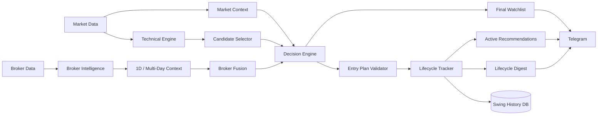
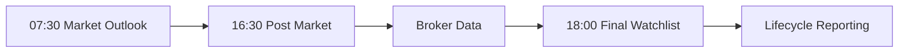
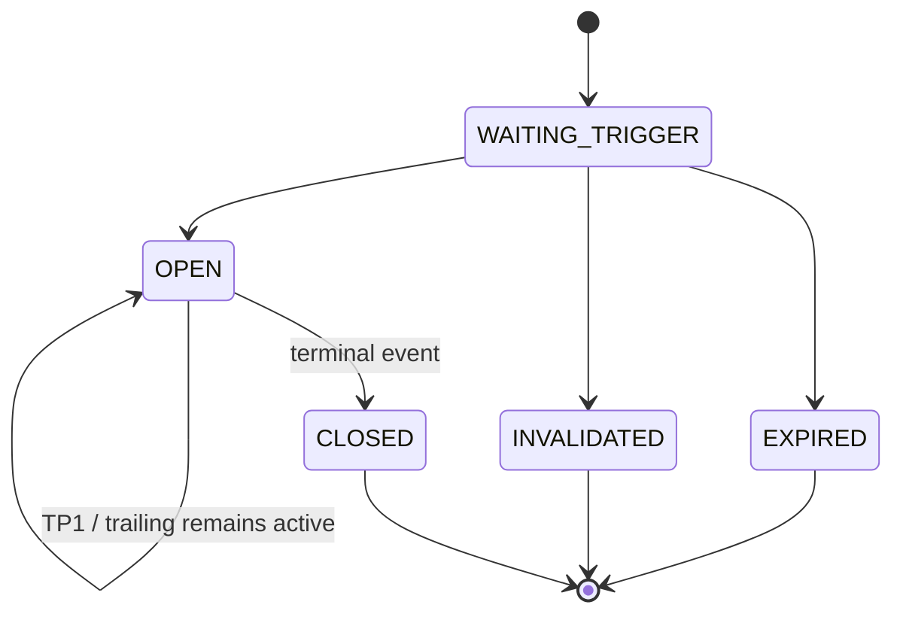

<div align="center">

# SDE Swing

### Stock Decision Engine for IDX Swing Trading

**Market Context · Technical Analysis · Broker Intelligence · Lifecycle Governance · Telegram Reporting**

[](https://github.com/Fikriafrizal99/sde-swing/actions/workflows/ci.yml)
[](https://github.com/Fikriafrizal99/sde-swing/releases/tag/v1.7.1)


A modular, supervised analytics and decision-support system for Indonesian equities.

</div>

> [!IMPORTANT]
> SDE Swing currently operates in supervised mode. The configured production profile is `MODERATE_BASELINE`, calibration is `SHADOW_ONLY`, and automatic entry is disabled.

## Project Status

| Item | Current state |
|---|---|
| Latest official release | [`v1.7.1`](https://github.com/Fikriafrizal99/sde-swing/releases/tag/v1.7.1) |
| Current version | `1.7.1` |
| Source branch | `main` |
| Stage | Official release / supervised operations |
| Production profile | `MODERATE_BASELINE` |
| Calibration | `SHADOW_ONLY` |
| Automatic entry | Disabled |
| Market | Indonesia Stock Exchange (IDX) |
| Primary interface | Windows Control Center + Telegram |
| CI runtime | Python 3.12 |

`v1.7.1` is the current official GitHub release. The system remains supervised decision support; publishing this release does not enable autonomous execution.

## Overview

SDE Swing separates data ingestion, market context, technical processing, broker intelligence, decision governance, lifecycle tracking, persistence, and reporting into dedicated modules. This keeps operational components independently testable while preserving a clear boundary between analysis and execution.

Core areas include market and sector context, technical feature generation, candidate selection, broker summary and multi-day context, portfolio history, lifecycle tracking, SQLite persistence, and Telegram reporting.

## Architecture



## Core Capabilities

| Area | Included capabilities |
|---|---|
| Market Intelligence | Market Outlook, market regime, sector context, global-market context, news monitoring |
| Technical Engine | Feature generation, setup classification, candidate selection, quality/readiness analysis |
| Broker Intelligence | Broker Summary, raw broker data, broker fusion, concentration and multi-day context |
| Decision Governance | Final Decision Engine, protected profile configuration, validation and guardrails |
| Lifecycle | Actionable-state tracking, terminal-state preservation, re-entry governance, lifecycle history |
| Portfolio | Position records, broker-history maintenance, position-management and evaluation support |
| Reporting | Market Outlook, Post Market, Final Watchlist, Active Recommendations, Lifecycle Digest |
| Data Integrity | Canonical paths, database archiving, source validation, runtime status and locking |
| Engineering | Quant freeze, regression tests, contract validation, release gates and credential checks |

## Operating Model

```text
DATA
  ↓
ANALYSIS
  ↓
DECISION SUPPORT
  ↓
USER REVIEW
  ↓
LIFECYCLE & PERFORMANCE TRACKING
```

The current system does not perform autonomous order placement.

## Daily Runtime

The active scheduler uses `Asia/Jakarta` and trading-day awareness.

| Time | Stage |
|---|---|
| 07:30 WIB | Market Outlook |
| 16:30 WIB | Post Market technical stage |
| After Post Market | Broker-data preparation/import |
| 18:00 WIB | Final Watchlist window begins |
| 18:30 WIB | Final Watchlist cutoff |



## Broker Intelligence

The repository contains broker bridge/fusion modules, broker-history tooling, multi-day broker processing, and Tampermonkey collectors for Stockbit Broker Summary. Broker collection remains separated from the core decision modules and downstream processing relies on validated input files.

Broker context supports daily and multi-session analysis, including 1D and multi-day windows such as 3D/5D where applicable. Daily portfolio history remains date-specific; aggregate windows do not replace canonical daily observations.

## Lifecycle Model



The lifecycle layer keeps current actionable state separate from history. Terminal lifecycles remain historical records, while later valid recommendations are represented as new lifecycle episodes under the repository's lifecycle governance rules.

## Windows Control Center

Start the main interface with:

```bat
RUN_SDE.bat
```

Available control groups include Daily Operations, Market Outlook, Post Market, Broker Operations, Final Watchlist, Portfolio Operations, Performance & Evaluation, System & Status, and Maintenance.

Dedicated root launchers are also available:

```text
RUN_MARKET_OUTLOOK.bat
RUN_POST_MARKET.bat
RUN_FINAL_WATCHLIST.bat
CHECK_SDE_STATUS.bat
```

## Quick Start

```bat
git clone https://github.com/Fikriafrizal99/sde-swing.git
cd sde-swing
maintenance\INSTALL_REQUIREMENTS.bat
RUN_SDE.bat
```

Keep service credentials, Telegram identifiers, browser sessions, and other secrets outside Git-tracked source files. See the repository documentation before enabling optional integrations.

## Repository Structure

```text
sde-swing/
├── .github/workflows/       # CI and validation
├── config/                  # Pipeline, scheduler and source configuration
├── data/                    # Runtime data, state and database artifacts
├── docs/                    # Architecture and engineering documentation
├── maintenance/             # Windows operational tools
├── modules/                 # Core application modules
├── scheduler/               # Non-interactive scheduled launchers
├── tampermonkey/            # Broker-data collection tooling
├── tests/                   # Regression and contract tests
├── tools/                   # Validation and operational utilities
├── RUN_SDE.bat              # Main Control Center
└── README.md
```

## Engineering & Validation

The main CI workflow validates compilation, the quantitative freeze contract, regression tests, runtime configuration, canonical/multi-day contracts, stabilization release gates, source integrity, and credential hygiene.

```bat
python -m compileall -q .
python tools/ci_validate_quant_freeze.py
python -m pytest -q
python tools/ci_validate_runtime_config.py
python tools/ci_validate_contracts.py
python tools/ci_validate_stabilization_release.py
git diff --check
```

Test totals are intentionally not hardcoded here so CI status remains the current source of truth.

## Versioning & Releases

| Channel | Version / Ref | Meaning |
|---|---|---|
| Official Release | [`v1.7.1`](https://github.com/Fikriafrizal99/sde-swing/releases/tag/v1.7.1) | Current published GitHub release |
| Package Version | `1.7.1` | Current package/config/runtime version |
| Main Branch | `main` | Current source of truth |

Historical release material remains available under `docs/archive/` instead of being duplicated in this landing page.

## Documentation

- [Architecture](docs/ARCHITECTURE.md)
- [Configuration](docs/CONFIGURATION.md)
- [Data Sources](docs/DATA_SOURCES.md)
- [Runtime Jobs](docs/RUNTIME_JOBS.md)
- [Telegram Routing](docs/TELEGRAM_ROUTING.md)
- [Troubleshooting](docs/TROUBLESHOOTING.md)
- [Stabilization Baseline](docs/SDE_STABILIZATION_BASELINE.md)
- [Stabilization Traceability](docs/SDE_STABILIZATION_AUDIT_TRACEABILITY.md)

> [!CAUTION]
> Market analysis involves uncertainty and financial risk. SDE Swing is an analytical decision-support project and does not guarantee outcomes.

---

<div align="center">

**SDE Swing · Supervised Decision Intelligence for IDX**

`MODERATE_BASELINE` · `SHADOW_ONLY` · `AUTO ENTRY DISABLED`

</div>
